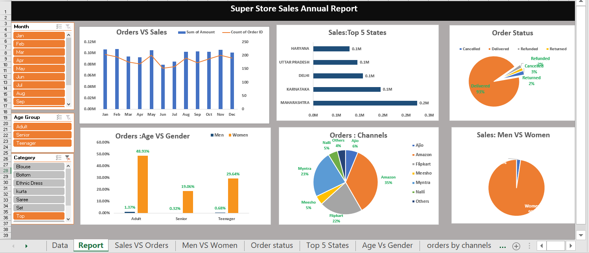

#  Superstore Sales Dashboard - Excel Visualization

This project presents a dynamic **Excel-based dashboard** that provides a comprehensive overview of annual sales data for a superstore. The dashboard is designed to analyze and visualize critical KPIs such as sales performance, customer demographics, channel effectiveness, order status, and geographical sales insights.

---

## 📌 Features

- 📈 **Orders vs Sales** chart to analyze order volume and revenue trends across months
- 🌍 **Top 5 States** by sales performance
- 🎯 **Order Status** distribution (Delivered, Cancelled, Refunded, Returned)
- 👨‍👩‍👧‍👦 **Age vs Gender** analysis of customer orders
- 🛒 **Orders by Channel** (Amazon, Flipkart, Myntra, etc.)
- 🚻 **Sales by Gender** comparison (Men vs Women)
- 🧭 Slicers for:
  - Month
  - Age Group
  - Product Category

---

## 📷 Dashboard Preview

  
*Interactive Excel Dashboard with slicers and dynamic visualizations*

---

## 📊 Tools Used

- Microsoft Excel (Pivot Tables, Charts, Slicers, Conditional Formatting)

---

## 🚀 Getting Started

1. Download or clone the repository.
2. Open `Super Store Data Analysis.xlsx` using Microsoft Excel.
3. Interact with the slicers to filter by month, age group, and category.

---

## 📫 Contact

For questions, suggestions, or collaborations:

**Muhammad Usman Akram**  
📧 [musman00109@gmail.com]  
🔗 [LinkedIn](www.linkedin.com/in/muhammad-usman-akram-b29685251)

---

## 🌟 Acknowledgement

This project is part of my continuous learning journey in **data analysis and visualization**. Your feedback and suggestions are most welcome!
